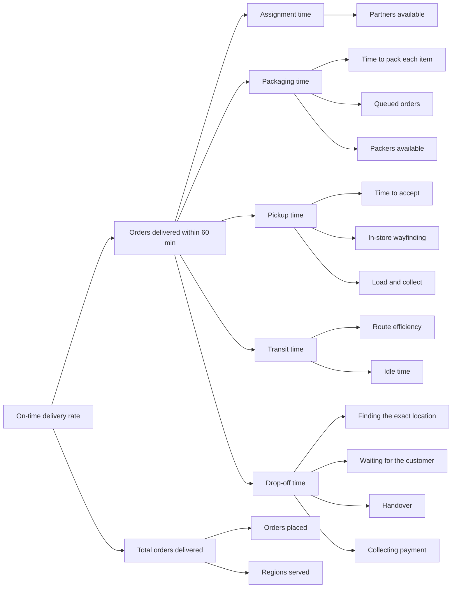

# HomeRun delivery partner app, MVP

MVP of delivery partner app for HomeRun, plus an internal ops console that
reads the same orders. 

**Live demo:** https://homerundeliverypartnerapp.vercel.app/
**Run locally:** `npm install && npm run dev`

---

## 1. KPI tree 

Metrics Breakdown:

| Branch | Computed as |
| --- | --- |
| Assignment time | `ts.assigned - ts.placed` |
| Packaging time | `ts.ready - ts.routed` |
| Pickup time | `ts.picked - ts.accepted` |
| Transit time | `ts.arrived - ts.picked` |
| Drop-off time | `ts.completed - ts.arrived` |
| On-time delivery rate | delivered orders where `ts.completed - ts.placed <= 60 min` |

---

## 2. States designed

One order object moves through a state machine. Both the app and the dashboard
read the same array.

| State | Partner screen | What happens |
| --- | --- | --- |
| `placed` | Incoming order card | Mock consumer order created with items, address and COD |
| `routed` | Incoming order card | Lands in the nearest dark store queue |
| `packing` | Incoming order card | Picker is packing, partner can see it coming |
| `ready` | Incoming order card | Packed, weight known, sitting at a gate |
| `allocating` | Matching a partner | Every partner ranked by distance, anyone whose vehicle cannot take the load is skipped with a reason |
| `assigned` | New order card | Items, gates, payout, load, accept or decline |
| `accepted` | Ride to the store | Map, ETA, gate sequence preview |
| `at_store` | Gate plan | Numbered route through the yard with what sits behind each gate |
| `at_gate` | Gate detail | Order ID to read out, picker name, items at that gate, scan button |
| `gate_move` | Move to next gate | Only appears when the order spans more than one gate |
| `verified` | Loaded | Green tick per gate, slide to mark picked |
| `picked` / `en_route` | Ride to the drop | Live route, ETA, call and chat, cash amount |
| `arrived` | Handover | Unit by unit checklist, photo, OTP |
| `pod_ok` | Collect cash | Amount due, cash collected, short on cash, or pay by UPI |
| `paid` | Payment completed | How it settled, then complete order |
| `completed` | Trip summary | Earnings, surge, units delivered, minutes of 60, then rate the customer |

In a materials dark store, cement and pipes come off a loading dock, paint comes out of a sealed bay, and small electrical goods come over a counter. Sending one partner to one door means dragging 150 kg
across a store floor. So each SKU carries its gate, the app builds the driving route through the yard, and the partner scans a separate picker QR at each gate.

---

## 3. Logic

- **Vehicle capacity decides the assignment, not just distance.** A bike 0.9 km
  away is skipped for a Tata Ace 0.4 km away when the load is 150 kg. The
  allocation screen shows the partner why the job came to them.

- **Units, not kilos, everywhere the partner counts.** "4 lengths, 3 m each" and
  "3 bags, 50 kg each". Weight only appears where it decides the vehicle. A
  summary saying "96 kg collected" tells a rider nothing about whether they have
  everything.

- **The trip cannot close unpaid.** There is no "log as pending" exit. If the
  customer is short on cash, the app shows a UPI QR for the balance. Cash, UPI
  or a split of both, but the order only completes when the money is in.

- **One state object.** The app and the dashboard read the same `orders` array. 

---

## 4. Tech stack

| Layer | Choice |
| --- | --- |
| Frontend | React + Vite | 
| State | `useReducer`, in memory | 
| Styling | Plain CSS with tokens | 
| Maps | Leaflet + OpenStreetMap | 
| QR | `qrcode-generator` | 
| Hosting | Vercel | 

---

## 5. Edge cases

**Built and triggerable from the ops console:**

| Case | What the app does |
| --- | --- |
| Partner declines or times out | Reassigns to the next nearest eligible partner |
| Wrong item at the gate scan | Blocks that gate only, flags the order, clears on rescan |
| Customer unreachable | Logs the attempts, starts a wait before the return option opens |
| Cash short at the doorstep | Opens a UPI QR for the balance so the trip still closes paid |
| Partner drops off the network | Freezes the trip locally, keeps the SLA clock running, syncs on return |
| SLA breach | Fires on its own at 60 minutes, flags the order red and raises a ticket |

---

## 6. Additional features

**Ops console.** An internal dashboard sitting on the same orders. It opens with
the on-time rate, orders booked, delivered on time, late or breaching, at risk,
and average delivery time. Each card filters the order table. Below that, a live
pipeline with an SLA countdown per order, then a bar per stage answering where
the hour is going. The Orders view has search by order ID or customer, filters
for status, risk, ticket and dark store, and an order detail with its own stage
times and the full support ticket thread. Delivery management is live; order
management, inventory, customer support and partner onboarding are stubs with a
note on what they would read.

**Hindi.** A partner picks their language on first launch, before anything else,
with both options shown in their own script so the choice does not require
reading English. The whole partner flow is translated, including toasts, which
are stored as a key plus variables and translated at render. The console stays
in English, since internal teams use it. There is a toggle in the demo controls
to switch mid demo.

**Customer rating.** A five star sheet after delivery and payment.