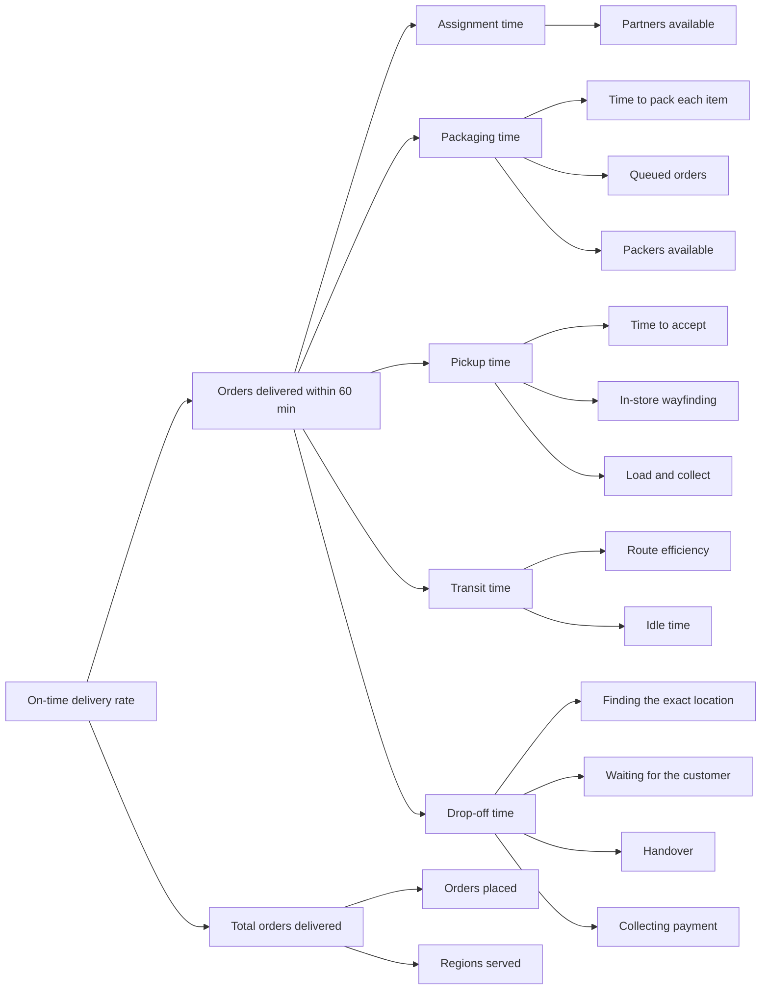

# HomeRun delivery partner app, MVP

A working delivery partner app for HomeRun, plus an internal ops console that
reads the same orders. Built as a demo, not a prototype deck: you can run a
whole trip from order intake to cash collected.

**Live demo:** _add your Vercel link_
**Run locally:** `npm install && npm run dev`

---

## 1. How I thought about the problem

- **The 60 minute promise is the product.** HomeRun sells construction material
  in 60 minutes. Everything the partner app does either protects that number or
  explains where it went. So I built the clock in first and designed screens
  around it, rather than designing screens and adding a timer later.

- **This is not food delivery with heavier bags.** A cement order is 150 kg. It
  cannot go on a bike, it cannot be carried across a store floor, and it is not
  counted in "items". Three decisions came out of that: vehicle capacity gates
  the assignment, pickup is split across loading gates, and everything the
  partner counts is in trade units, not kilos.

- **Where the hour actually goes is a question nobody can answer without stage
  timestamps.** I stamped every status change from day one, which is what lets
  the dashboard break the 60 minutes into assignment, packaging, pickup,
  transit and drop-off without any extra tracking code.

- **The partner is the real user, not the reviewer.** Short screens, one
  decision per screen, big numbers, slide to confirm for anything irreversible,
  and Hindi as a first class option picked before anything else happens.

- **A narrow flow that fully works beats a broad flow that half works.** I built
  the happy path end to end with real interactivity, mocked order intake behind
  one button, and listed the edge cases I deliberately left out.

---

## 2. The KPI tree I am tracking

Every branch is arithmetic on the timestamps, no separate analytics layer:

| Branch | Computed as |
| --- | --- |
| Assignment time | `ts.assigned - ts.placed` |
| Packaging time | `ts.ready - ts.routed` |
| Pickup time | `ts.picked - ts.accepted` |
| Transit time | `ts.arrived - ts.picked` |
| Drop-off time | `ts.completed - ts.arrived` |
| On-time delivery rate | delivered orders where `ts.completed - ts.placed <= 60 min` |

The stamping happens in one place. When an action changes an order's status,
the reducer writes `order.ts[status] = now`. No screen has to remember to log
anything.

---

## 3. What I built and what I mocked

| Part | Status | Why |
| --- | --- | --- |
| Partner app, assignment to payment | Fully interactive | This is the assignment |
| Order intake, states 1 to 4 | Mocked behind a simulator card on the home screen | No consumer app exists to place real orders |
| Ops console | Live, reads the same orders | Shows the systems view without a second data source |
| Maps | Real OpenStreetMap tiles, simulated movement | Real map, no GPS or permissions in a demo |
| QR scan | Full scanner UI, confirms on tap | A camera permission prompt breaks a live demo |
| Payments | UPI QR is a real `upi://pay` intent, nothing settles | Scannable, honest about what it does |

The demo clock runs at 10x by default, so a 60 minute SLA plays out in six
minutes. You can switch to 1x or 30x in the header.

---

## 4. The states I designed

One order object moves through a state machine. Both the app and the dashboard
read the same array.

| State | Partner screen | What happens |
| --- | --- | --- |
| `placed` | Incoming order card | Mock consumer order created with items, address and COD |
| `routed` | Incoming order card | Lands in the nearest dark store queue |
| `packing` | Incoming order card | Picker is packing, partner can see it coming |
| `ready` | Incoming order card | Packed, weight known, sitting at a gate |
| `allocating` | Matching a partner | Every partner ranked by distance, anyone whose vehicle cannot take the load is skipped with a reason |
| `assigned` | New order card | Items, gates, payout, load, accept or decline |
| `accepted` | Ride to the store | Map, ETA, gate sequence preview |
| `at_store` | Gate plan | Numbered route through the yard with what sits behind each gate |
| `at_gate` | Gate detail | Order ID to read out, picker name, items at that gate, scan button |
| `gate_move` | Move to next gate | Only appears when the order spans more than one gate |
| `verified` | Loaded | Green tick per gate, slide to mark picked |
| `picked` / `en_route` | Ride to the drop | Live route, ETA, call and chat, cash amount |
| `arrived` | Handover | Unit by unit checklist, photo, OTP |
| `pod_ok` | Collect cash | Amount due, cash collected, short on cash, or pay by UPI |
| `paid` | Payment completed | How it settled, then complete order |
| `completed` | Trip summary | Earnings, surge, units delivered, minutes of 60, then rate the customer |

**The gate sequence is the part I am most confident about.** Most delivery
apps stop at "go to the store". In a materials dark store, cement and pipes come
off a loading dock, paint comes out of a sealed bay, and small electrical goods
come over a counter. Sending one partner to one door means dragging 150 kg
across a store floor. So each SKU carries its gate, the app builds the driving
route through the yard, and the partner scans a separate picker QR at each gate.

---

## 5. Decisions worth explaining

- **Vehicle capacity decides the assignment, not just distance.** A bike 0.9 km
  away is skipped for a Tata Ace 0.4 km away when the load is 150 kg. The
  allocation screen shows the partner why the job came to them.

- **Units, not kilos, everywhere the partner counts.** "4 lengths, 3 m each" and
  "3 bags, 50 kg each". Weight only appears where it decides the vehicle. A
  summary saying "96 kg collected" tells a rider nothing about whether they have
  everything.

- **The trip cannot close unpaid.** There is no "log as pending" exit. If the
  customer is short on cash, the app shows a UPI QR for the balance. Cash, UPI
  or a split of both, but the order only completes when the money is in.

- **The 60 minute countdown lives on the ops board, not the partner's screen.**
  I had it on the phone first and removed it. A visible countdown pushes a rider
  carrying 150 kg to ride faster. Ops needs the clock to intervene; the partner
  needs the next instruction.

- **One state object.** The partner app and the dashboard read the same
  `orders` array. Nothing to sync, nothing to drift, and the dashboard is proof
  the flow produces usable data.

---

## 6. Tech stack

| Layer | Choice | Why |
| --- | --- | --- |
| Frontend | React + Vite | Fastest path to responsive screens, no build ceremony |
| State | `useReducer`, in memory | One source of truth, no backend to keep in sync |
| Styling | Plain CSS with tokens | The brand palette is fixed by HomeRun's site, no framework needed |
| Maps | Leaflet + OpenStreetMap | Free, no API key, no billing account |
| QR | `qrcode-generator` | Renders inline SVG, so the UPI code is real and scannable |
| Auth | Skipped | Not needed for a demo |
| Hosting | Vercel | One command, free tier, live link |

**On maps:** the tiles are real OpenStreetMap through Leaflet. The route is a
fixed polyline between two real Bengaluru coordinates, and the marker moves
along it with the trip progress. Distances and ETAs are computed from those
coordinates with haversine, so a Koramangala drop really does pay more than a
Domlur one. No routing engine, no GPS, no permission prompt. The dark store yard
is a hand drawn SVG instead, because gate positions inside a private compound
are not in OpenStreetMap and the point of that screen is the driving order
between gates.

---

## 7. Edge cases

**Built and triggerable from the ops console:**

| Case | What the app does |
| --- | --- |
| Partner declines or times out | Reassigns to the next nearest eligible partner |
| Wrong item at the gate scan | Blocks that gate only, flags the order, clears on rescan |
| Customer unreachable | Logs the attempts, starts a wait before the return option opens |
| Cash short at the doorstep | Opens a UPI QR for the balance so the trip still closes paid |
| Partner drops off the network | Freezes the trip locally, keeps the SLA clock running, syncs on return |
| SLA breach | Fires on its own at 60 minutes, flags the order red and raises a ticket |

**Considered and cut from this MVP:**

- Batching two drops on one trip inside the same 60 minute window
- Return to store for a refused or damaged consignment, torn cement bags included
- Weight mismatch between the packed slip and the weighbridge
- Gate pass and security check-in at apartment and site entrances
- Partner shift and payout ledger across a full day

---

## 8. Additional features

**Ops console.** An internal dashboard sitting on the same orders. It opens with
the on-time rate, orders booked, delivered on time, late or breaching, at risk,
and average delivery time. Each card filters the order table. Below that, a live
pipeline with an SLA countdown per order, then a bar per stage answering where
the hour is going. The Orders view has search by order ID or customer, filters
for status, risk, ticket and dark store, and an order detail with its own stage
times and the full support ticket thread. Delivery management is live; order
management, inventory, customer support and partner onboarding are stubs with a
note on what they would read.

**Hindi.** A partner picks their language on first launch, before anything else,
with both options shown in their own script so the choice does not require
reading English. The whole partner flow is translated, including toasts, which
are stored as a key plus variables and translated at render. The console stays
in English, since internal teams use it. There is a toggle in the demo controls
to switch mid demo.

**Customer rating.** A five star sheet after delivery and payment, matching what
riders already do on Blinkit and Zomato.

---

## 9. What I would build next

1. Real order intake from a consumer app, replacing the simulator
2. Batching, since two drops in one direction inside the same window is the
   single biggest lever on partner earnings
3. A routing engine for real ETAs instead of a fixed polyline
4. Alerting on the ops board rather than a passive red card, so a breach pages
   someone
5. Partner earnings and shift history, which is the screen riders actually open
   most